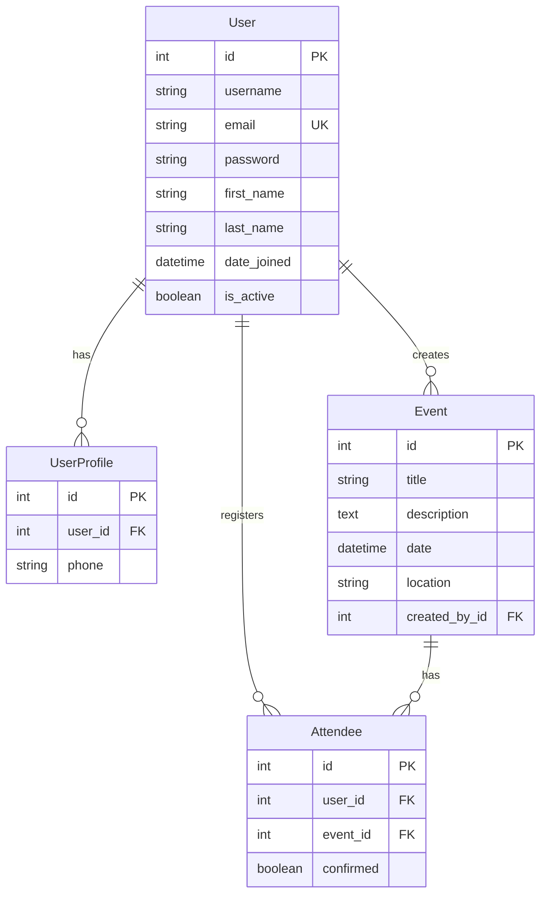

# 🎉 Event Planner

## 📋 Backend Repository

This is the backend API for the Event Planner application, built with Django REST Framework.

**🔗 Frontend Repository**: [Event Planner Frontend](https://github.com/m-alhamry/Event-Planner-FE)

## 🗄️ Database Schema & ERD

### Entity Relationship Diagram



### 📊 Database Tables

#### 1. **User** (`auth_user`)
| Column | Type | Description |
|--------|------|-------------|
| `id` | Integer | Primary Key |
| `username` | String | Unique username |
| `email` | String | Unique email address |
| `password` | String | Hashed password |
| `first_name` | String | User's first name |
| `last_name` | String | User's last name |
| `date_joined` | DateTime | Account creation timestamp |
| `is_active` | Boolean | Account active status |

#### 2. **UserProfile** (`user_profile`)
| Column | Type | Description |
|--------|------|-------------|
| `id` | Integer | Primary Key |
| `user_id` | Integer | Foreign Key to User |
| `phone` | String | Optional phone number |

#### 3. **Event** (`event`)
| Column | Type | Description |
|--------|------|-------------|
| `id` | Integer | Primary Key |
| `title` | String | Event title |
| `description` | Text | Event description |
| `date` | DateTime | Event date and time |
| `location` | String | Event location |
| `created_by_id` | Integer | Foreign Key to User |

#### 4. **Attendee** (`attendee`)
| Column | Type | Description |
|--------|------|-------------|
| `id` | Integer | Primary Key |
| `user_id` | Integer | Foreign Key to User |
| `event_id` | Integer | Foreign Key to Event |
| `confirmed` | Boolean | Attendance confirmation status |

### 🔗 Relationships

- **One-to-One**: `User` ↔ `UserProfile`
- **One-to-Many**: `User` → `Event` (created_events)
- **One-to-Many**: `User` → `Attendee` (registrations)
- **One-to-Many**: `Event` → `Attendee` (attendees)
- **Many-to-Many**: `User` ↔ `Event` (through Attendee)

### 🗝️ Key Constraints

- **Unique Email**: Each user must have a unique email address
- **Unique Registration**: Users can only register for an event once
- **Cascading Deletes**: When a user is deleted, their profile and created events are also deleted
- **Foreign Key Constraints**: All relationships maintain referential integrity

## 🚀 Quick Start

1. **Clone the repository**
   ```bash
   git clone [backend-repo-url]
   cd Event-Planner
   ```

2. **Install dependencies**
   ```bash
   pip install pipenv
   pipenv install
   ```

3. **Run migrations**
   ```bash
   python manage.py makemigrations
   python manage.py migrate
   ```

4. **Create superuser (optional)**
   ```bash
   python manage.py createsuperuser
   ```

5. **Start the server**
   ```bash
   python manage.py runserver
   ```

## 📡 API Endpoints

### Authentication Endpoints
| Method | Endpoint | Description |
|--------|----------|-------------|
| POST | `/api/auth/signup/` | Register new user |
| POST | `/api/auth/signin/` | Login user |
| GET | `/api/auth/profile/` | Get user profile |
| PUT | `/api/auth/profile/` | Update user profile |
| PUT | `/api/auth/password-update/` | Update password |
| POST | `/api/auth/logout/` | Logout user |

### Event Endpoints
| Method | Endpoint | Description |
|--------|----------|-------------|
| GET | `/api/events/` | List all events |
| POST | `/api/events/create/` | Create new event |
| GET | `/api/events/{id}/` | Get event details |
| PUT | `/api/events/{id}/update/` | Update event |
| DELETE | `/api/events/{id}/delete/` | Delete event |
| GET | `/api/events/my-events/` | Get user's created events |
| GET | `/api/events/my-attending/` | Get events user is attending |

### Attendance Endpoints
| Method | Endpoint | Description |
|--------|----------|-------------|
| GET | `/api/events/{id}/attendees/` | Get event attendees |
| POST | `/api/events/{id}/attend/` | Register for event |
| POST | `/api/events/{id}/confirm-attendance/` | Confirm attendance |
| POST | `/api/events/{id}/decline-attendance/` | Decline attendance |
| POST | `/api/events/{id}/cancel-attendance/` | Cancel registration |

### User Stats Endpoints
| Method | Endpoint | Description |
|--------|----------|-------------|
| GET | `/api/auth/stats/user/` | Get user statistics

## 🛠️ Technologies Used

#### ⚙️ Backend Technologies
- **Django 4.2+**: Web framework
- **Django REST Framework**: API framework
- **PostgreSQL**: Database (production-ready)
- **JWT Authentication**: Token-based authentication
- **Django CORS Headers**: Cross-origin resource sharing
- **Custom Validators**: Data integrity validation

#### 🔐 Security Features
- **Password Hashing**: Secure password storage
- **JWT Tokens**: Secure authentication tokens
- **CORS Configuration**: Cross-origin request handling
- **Input Validation**: Comprehensive data validation

## 📊 Database Configuration

### Migration Commands
```bash
# Create migrations
python manage.py makemigrations

# Apply migrations
python manage.py migrate

# Create superuser
python manage.py createsuperuser

# Run development server
python manage.py runserver
```

## 🔗 Relationships Summary

- **Users** can create multiple **Events**
- **Users** can register for multiple **Events** through **Attendee**
- **Events** can have multiple **Attendees**
- **Users** have optional **UserProfile** for additional information

This creates a clean, normalized database structure that supports all the required functionality while maintaining referential integrity and performance.